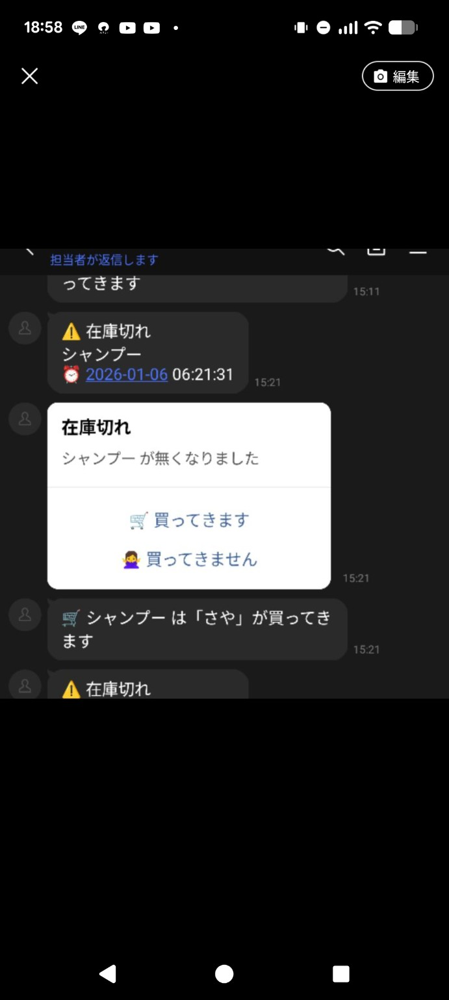
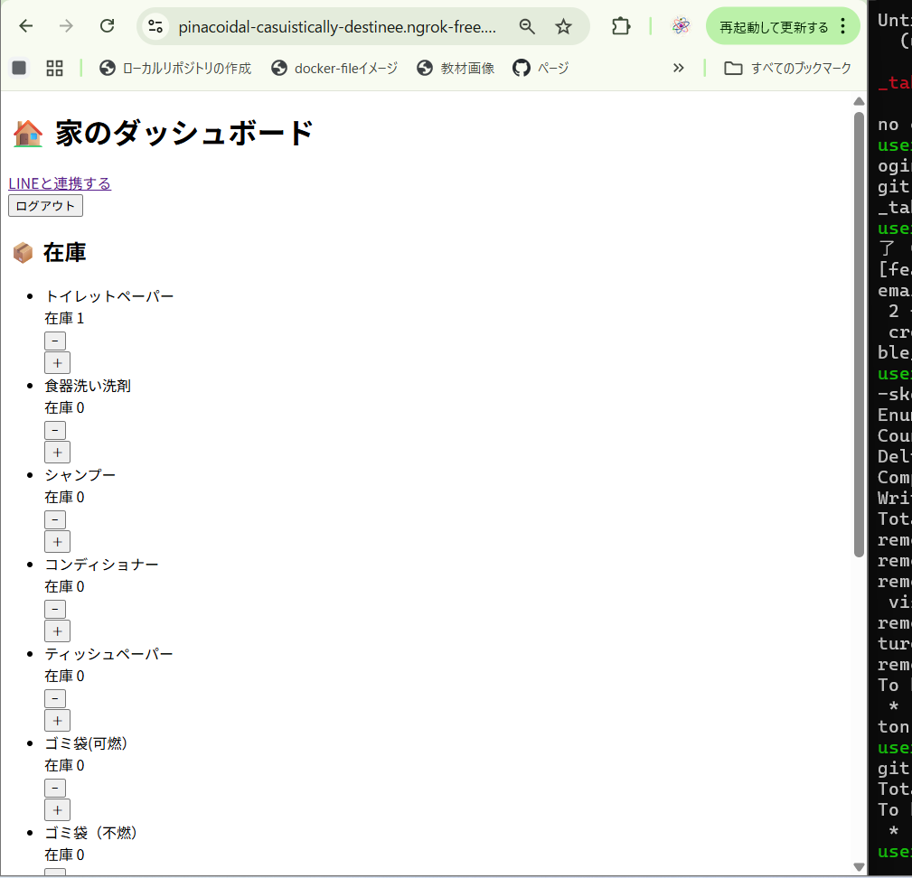
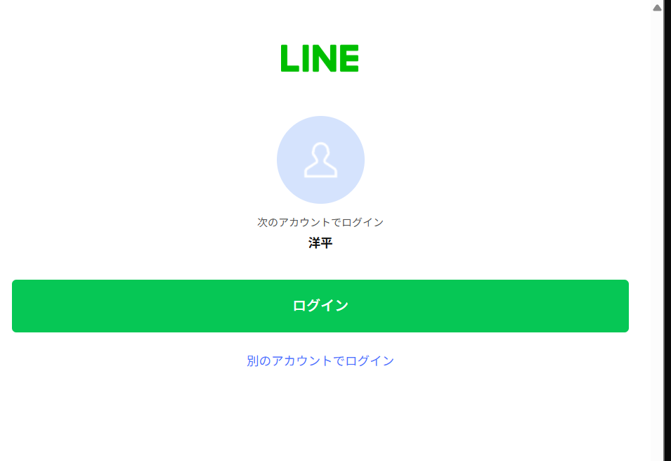
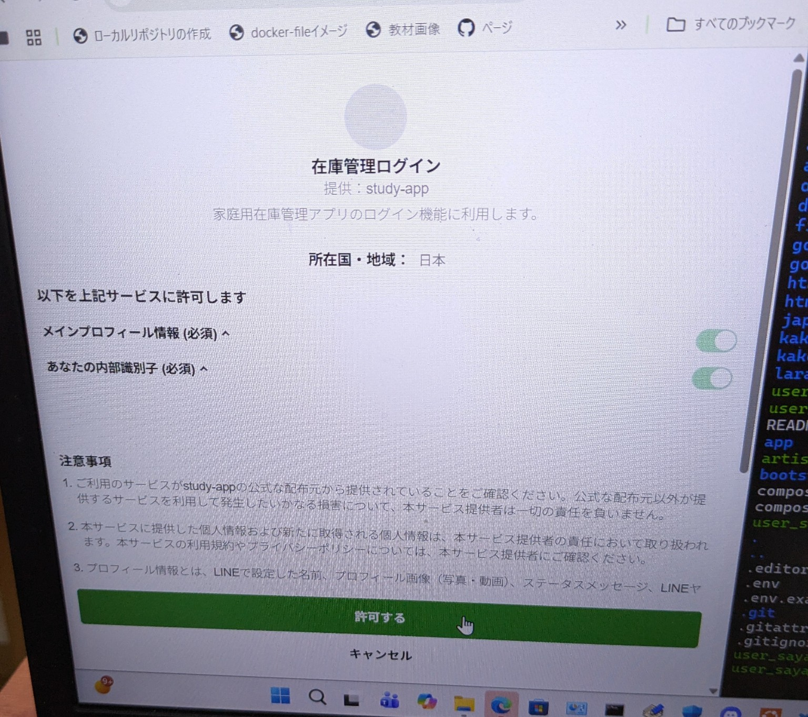

# 家庭内在庫管理 × LINE通知アプリ

## 概要
家庭内の消耗品を管理し、  
在庫がなくなった瞬間に LINE へ通知を送る Laravel アプリです。

「気づいたら無くなっていた」を防ぐことを目的に、  
**在庫が 1 → 0 になったタイミングのみ** 自動通知を行います。

※ 本アプリは学習目的のポートフォリオです  
※ LINE 通知は Messaging API を利用しています

---

## デモ / スクリーンショット

### 1. 在庫切れ通知 → 担当者確定（LINE）

在庫が 1 → 0 になった瞬間にLINE通知が送信され、
「買ってきます」を最初に押したユーザーが担当者として確定します。

---

### 2. 在庫一覧（Web画面)

家庭内の消耗品を一覧で管理し、在庫数の増減が可能です。

---

### 3. 在庫切れ通知（LINE）

在庫切れ時にLINE Messaging APIを利用して自動通知を送信します。

---

### 4. LINEログイン / 認可画面

LINEログインを利用したユーザー認証を行っています。

### 在庫一覧画面
- 家庭内備品の在庫を一覧表示
- 在庫数の増減が可能

### LINE 通知
- 在庫が 1 → 0 になった瞬間に通知
- 通知にはアクションボタンを表示

### LINE ボタン操作
- 🛒 買ってきます
- 🙅‍♀️ 買ってきません

### LINE 認可画面
- LINE ログインによるユーザー認証

（※ スクリーンショット画像は `/screenshots` 配下に配置）

---

## 主な機能
- ユーザー認証（Laravel Breeze）
- 家庭用品の在庫管理（CRUD）
- 在庫が 1 → 0 になった際の LINE 通知
- LINE ボタン操作によるユーザーアクション
- LINE Webhook によるユーザー紐づけ
- Service クラスによる外部 API 処理の分離

---

## 処理フロー
1. ユーザーがログイン
2. 在庫一覧を表示
3. 「−」ボタンで在庫を減らす
4. 在庫が 1 → 0 になった瞬間に LINE へ通知
5. LINE のボタンを押下
6. Webhook を受信し、結果画面へ遷移

---

## 使用技術
- Laravel
- PHP
- LINE Messaging API
- ngrok
- Tailwind CSS
- SQLite / MySQL
- Git / GitHub

---

## 学習目的
Laravel を用いた CRUD 実装だけでなく、  
外部 API との連携・Webhook 処理・実運用を想定した設計を学ぶことを目的としました。

特に、
- 境界値（1 → 0）の判定
- 外部 API を Service クラスに分離する設計
- 実装後の振り返り（Postmortem）

を重視しています。

---

## トラブルシューティング（Postmortem）

### 発生した問題
LINE 通知機能を実装する過程で、  
**LINE ログインと Messaging API を同時に扱い、複数のチャネルを作成してしまった** ことで  
userId の管理に不整合が発生しました。

---

### LINE 連携における重要な原則
- **userId は「チャネル × ユーザー」で一意に決まる**
  - 同じ人でも、チャネルが異なれば userId は別になる
- **LINE ログイン と Messaging API（Bot）は別物**
  - 役割が異なるため混在させると設計が破綻する
- **家族全員に通知したい場合の正解構成**
  - 1つの Bot / 1つのチャネルに統一
  - DB に複数の line_user_id を保存
  - multicast またはループ送信を行う

---

### 対応と学び
- ログと DB を確認し原因を切り分け
- unique 制約の影響に気づいた
- Git で状態を戻し、設計を整理
- チャネル構成と userId の保存ルールを明確化
- 再実装方針を決定

本件を通して、  
**「外部 API は機能だけでなく設計思想を理解して扱う必要がある」**  
という重要な学びを得ました。

## 今後の改善予定（ロードマップ）

本アプリは学習目的のポートフォリオとして、
実運用を想定した設計・改善を段階的に行う予定です。

### 1. 複数ユーザー（家族）への同時通知対応
- 1つの LINE Bot / チャネルを利用し、家族全員に同時通知を送信
- DB に複数の `line_user_id` を保持し、multicast またはループ送信を実装

### 2. 「買います」ボタンの排他制御
- 最初に「買います」を押したユーザーを購入担当者として確定
- 以降の操作は無効化し、他ユーザーには  
  「〇〇さんが買ってきます」と通知
- 状態管理（waiting / assigned / done）による二重処理防止

### 3. 未対応時の自動リマインド通知
- 一定時間（例：2時間）誰も対応していない場合に再通知
- 購入担当者が確定した時点でリマインドを自動停止
- 時間ベース処理は Laravel の Scheduler / Command を使用

### 4. 通知・購入履歴の管理
- 在庫切れイベントおよび通知履歴を DB に保存
- 誰が・いつ・何を購入担当したかを確認可能にする

### 5. 設計・保守性の向上
- LINE API 処理を Service クラスへ分離
- Controller / Service / Command の責務を明確化
- 将来的な機能追加を考慮した設計へ改善
