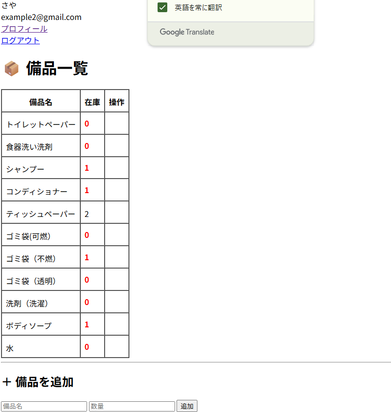
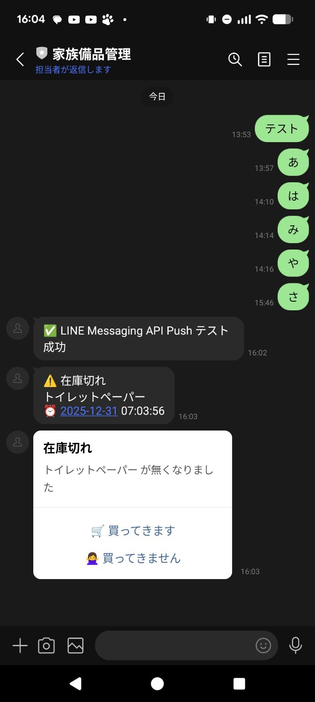
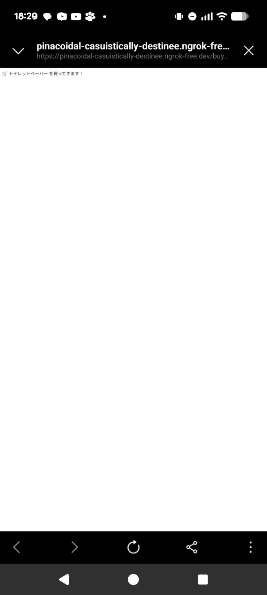

# 家庭内在庫管理 × LINE通知アプリ

## 概要
家庭内の消耗品を管理し、  
**在庫がなくなった瞬間に LINE へ通知を送る** Laravel アプリです。

「気づいたら無くなっていた」を防ぐことを目的に、  
在庫が **1 → 0** になったタイミングで自動通知を行います。

---

## 主な機能
- ユーザー認証（Laravel Breeze）
- 在庫の登録・増減（CRUD）
- 在庫が 1 → 0 になった際の LINE 通知
- LINEボタン操作  
  - 🛒 買ってきます  
  - 🙅‍♀️ 買ってきません
- LINE Webhook によるユーザー紐づけ
- Service クラスによる外部API分離

---

## 使用技術
- Laravel
- PHP
- LINE Messaging API
- ngrok
- Tailwind CSS
- SQLite / MySQL
- Git / GitHub

---

## 処理フロー
1. ログイン後、在庫一覧を表示
2. 「−」ボタンで在庫を減らす
3. 在庫が 1 → 0 になった瞬間に LINE へ通知
4. LINEのボタンを押す
5. Webhook を受信し、結果画面へ遷移

---

## 工夫した点
- 在庫減少の **境界値（1 → 0）** のみで通知を送信
- LINE API の処理を Service クラスに分離
- ngrok を使った外部公開で実機動作を確認
- Git管理時に不要ファイルを除外し、リポジトリを整理

---
## スクリーンショット






---

## 学習目的
Laravel を用いた CRUD 実装だけでなく、  
**外部 API との連携・Webhook 処理・実運用を想定した設計**を学ぶことを目的としました。
```
在庫が 1→0 になった瞬間のみ通知する、Laravel×LINE連携アプリを自作しました。Webhook・ngrokで実機確認まで行っています。
※ 本アプリは学習目的のポートフォリオです。
※ LINE連携は Messaging API を利用（トークン等は .env 管理）
```
